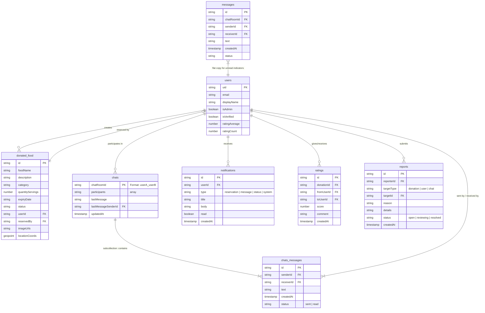
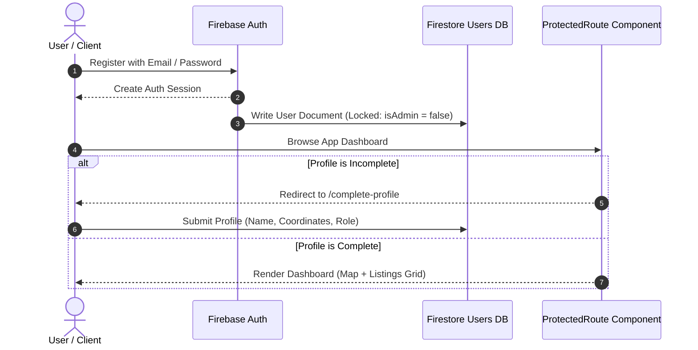
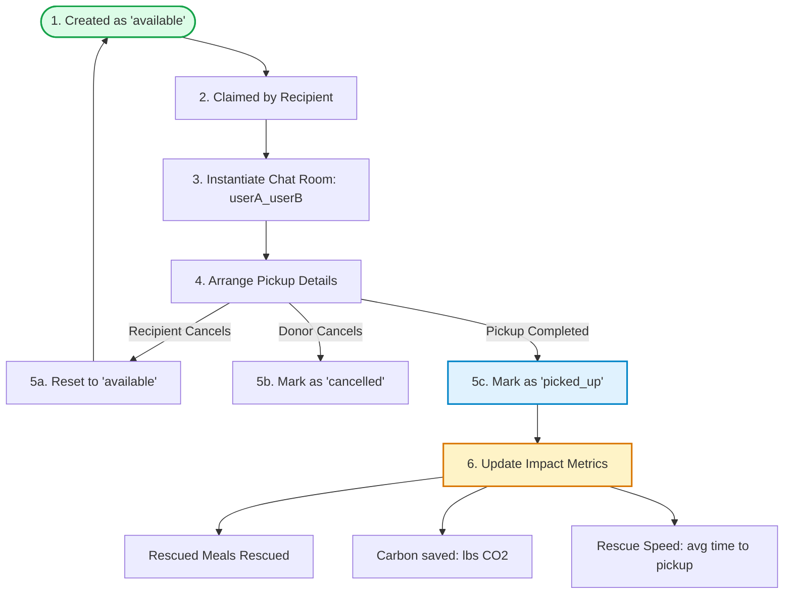

# 🥬 Food Waste Reduction Platform (FWRP) — Obsidian System Map

Welcome to the **FWRP** project system map! This document is optimized for Obsidian, featuring callouts, internal linking placeholders, database schemas, security posture reviews, and interactive **Mermaid** diagrams.

---

## 🗺️ Table of Contents

- [[#1. Executive Summary & Core Mission|1. Executive Summary & Core Mission]]
- [[#2. System Architecture|2. System Architecture]]
- [[#3. Database Entity Relationship Diagram (ERD)|3. Database Entity Relationship Diagram (ERD)]]
- [[#4. Core Workflows & Logic Flows|4. Core Workflows & Logic Flows]]
- [[#5. Database Models & Schema Specifications|5. Database Models & Schema Specifications]]
- [[#6. Security Infrastructure & Guardrails|6. Security Infrastructure & Guardrails]]
- [[#7. UI Design Token System (Vanilla CSS)|7. UI Design Token System (Vanilla CSS)]]
- [[#8. Localization & RTL (Right-to-Left) Architecture|8. Localization & RTL (Right-to-Left) Architecture]]
- [[#9. Directory Taxonomy Map|9. Directory Taxonomy Map]]
- [[#10. Getting Started & Development Setup|10. Getting Started & Development Setup]]

---

## 1. Executive Summary & Core Mission

The **Food Waste Reduction Platform (FWRP)** is a community-powered web application designed to reduce ecological and organic waste by matching **Donors** (restaurants, bakeries, supermarkets) directly with **Recipients** (shelters, food banks, charities) and **Volunteers** (helping with transport).

> [!NOTE]
> **Key Objective**: Keep usable surplus meals and ingredients out of landfills, directly lowering organic carbon emissions, and logging real-time community impact metrics (Meals Saved, Weight Rescued, Carbon Saved, and Rescue Speed).

---

## 2. System Architecture

FWRP utilizes a **decoupled Next.js App Router** design containing a client-side component layout, an abstract service manager, and serverless server API endpoints backed by **Firebase/Cloud Storage** and **Cloudinary** for scalable image storage.

```mermaid
graph TD
    subgraph Client [Client-Side Layer (Browser)]
        UI[React UI Components]
        AC[AuthContext / useAuth]
        SL[Service Layer: listingsService / chatsService]
        LC[LanguageContext / AR-EN RTL Toggle]
    end

    subgraph API [Next.js API Serverless Layer]
        EP[Serverless API Routes: /api/donated-food]
        SA[serverAuth / verifyRequestAuth]
        CSRF[csrf.ts / Token Validator]
        RL[rateLimit.ts / Memory Bucket]
    end

    subgraph Storage [Database & Assets Layer]
        FS[(Firebase Firestore)]
        CS[Cloudinary Image Storage]
        FBS[(Firebase Storage - User Avatars)]
    end

    %% Client Interactions
    UI --> AC
    UI --> SL
    UI --> LC
    SL -->|HTTP requests with Bearer Token| EP
    
    %% API Checks
    EP --> SA
    EP --> CSRF
    EP --> RL
    
    %% Backend Writes
    EP -->|Firebase Admin SDK| FS
    EP -->|Upload Stream| CS
    SL -->|Direct Firebase Client SDK| FS
    SL -->|Direct Avatar Upload| FBS
```

---

## 3. Database Entity Relationship Diagram (ERD)

Although Firebase Firestore is a NoSQL database, the documents are structured with strong schema relations. The diagram below details these document references and message subcollections.



---

## 4. Core Workflows & Logic Flows

### Onboarding & Role Assignment
When a user signs up, the default role is restricted to client privileges. They must fill in their profile coordinates to activate standard dashboards.



### Reservation & Pickup Lifecycle
Below is the status transitions of a listing, coordination chat, and impact metric logging.



---

## 5. Database Models & Schema Specifications

The following tables define the type rules, sizes, and collection structures in Firestore.

### Collection: `users`
*Documents represent user profiles synced with Firebase Auth.*

| Field Name | Type | Validation Rules | Description |
| :--- | :--- | :--- | :--- |
| `uid` | `string` | PK (Matches Auth UID) | Unique identifier for authentication. |
| `email` | `string` | Format check; Max 254 chars | Verified email from registration. |
| `displayName` | `string` | Min 2, Max 100 chars | Display or business name. |
| `isAdmin` | `boolean` | Default `false`, editable only by Admin | Determines administration dashboard access. |
| `isVerified` | `boolean` | Default `false` | Indicates verified donor or charity status. |
| `ratingAverage` | `number` | Floating point (0 - 5) | Average score from completed donations. |
| `ratingCount` | `number` | Integer >= 0 | Number of ratings submitted. |

### Collection: `donated_food`
*Documents represent food listings. Cleaned and checked in Next.js Server routes.*

| Field Name | Type | Validation Rules | Description |
| :--- | :--- | :--- | :--- |
| `id` | `string` | PK (Firestore Auto-ID) | Unique database ID. |
| `foodName` | `string` | Min 2, Max 100 chars | Title of the food. |
| `description` | `string` | Min 10, Max 2000 chars | Detailed list of items, state, etc. |
| `category` | `string` | produce \| cooked \| bakery \| pantry \| dairy \| other | Categorization for filtering. |
| `quantityServings`| `number` | Positive integer <= 1000 | Number of servings available. |
| `allergens` | `array of strings`| Max 20 items, split by commas | Potential allergens (nuts, dairy, etc). |
| `packaging` | `string` | Max 100 chars | Boxed, canned, plastic bags, etc. |
| `expiryDate` | `string` | ISO Date (Must be in the future) | Expiry timeline. |
| `pickupWindowStart`| `string` | Time string (HH:MM) | Beginning of collection hours. |
| `pickupWindowEnd` | `string` | Time string (HH:MM) | End of collection hours. |
| `pickupInstructions`| `string` | Max 500 chars | Specific location directions or instructions. |
| `imageUrls` | `array of strings`| Max 4 images | Cloudinary CDN image URLs. |
| `status` | `string` | available \| reserved \| picked_up \| expired \| cancelled \| removed | Listing lifecycle status. |
| `reservedBy` | `string \| null`| Matches user.uid | Claimer identifier. |
| `reservedAt` | `string \| null`| ISO Date | Reservation timestamp. |
| `pickedUpAt` | `string \| null`| ISO Date | Marked completed pickup timestamp. |
| `userId` | `string` | Matches user.uid | Donor owner ID. |

---

## 6. Security Infrastructure & Guardrails

FWRP is fortified with server-side validation filters, hardened firestore policies, and anti-forgery tokens.

> [!IMPORTANT]
> **Authentication Token Flow**
> Clients store Firebase ID tokens inside `localStorage` via the `AuthTokenManager`. Every API request injects the ID token inside the `Authorization: Bearer <Token>` header. The server verifies it in `verifyRequestAuth` using the server-side Firebase Admin SDK.

### Hardened Firewalls & Rules

```javascript
// Firestore Rules Snippet (firestore.rules)
match /users/{userId} {
  allow read: if isOwner(userId) || isAdmin();
  // Prevent users from self-promoting to admin on signup
  allow create: if isOwner(userId) 
                && (!('isAdmin' in request.resource.data) || request.resource.data.isAdmin == false);
  allow update: if (isOwner(userId) && !request.resource.data.diff(resource.data).affectedKeys().hasAny(['isAdmin', 'uid', 'email']))
                || isAdmin();
}
```

- **CSRF Token Verification**: Done using custom HTTP headers (`x-csrf-token`) synced with an `httpOnly` state cookie to prevent cross-site request forgery on server-side mutate methods.
- **Client Sanitization**: DOMPurify (`sanitizeText()`) strips raw HTML/Script elements on client input submissions prior to database write requests.
- **Rate-Limiting**: IP-based sliding memory window bucket constraints limit repeat requests to `/api/donated-food` and authentication endpoints.
- **Avatar Storage Rules**: Client avatars uploaded directly to Firebase Storage are limited to `image/*` formats and capped under 2MB.

---

## 7. UI Design Token System (Vanilla CSS)

Styling configuration variables are stored centrally inside [tokens.css](file:///D:/DEV/Projects/FWRP/src/styles/tokens.css) to facilitate layout-wide updates and seamless Dark Mode adaptation.

```css
:root {
  /* Brand Color Palette */
  --color-primary:       #2D6A4F;   /* Deep Forest Green */
  --color-primary-light: #52B788;   /* Fresh Mid-Green */
  --color-primary-soft:  #D8F3DC;   /* Pale Tint Backgrounds */
  --color-accent:        #F4A261;   /* Warm Amber (Food warmth signal) */
  --color-danger:        #E63946;
  --color-warning:       #F4A261;
  --color-success:       #52B788;
  
  /* Typography */
  --font-display: 'Plus Jakarta Sans', sans-serif;
  --font-body:    'Inter', sans-serif;

  /* Border Radii */
  --radius-sm:  6px;
  --radius-md:  10px;
  --radius-lg:  16px;
  --radius-xl:  24px;
}
```

---

## 8. Localization & RTL (Right-to-Left) Architecture

FWRP has complete multilingual support (English and Arabic) managed by a global React `LanguageContext`.

> [!TIP]
> **Arabic Layout Support**
> Selecting Arabic triggers a direction toggle on the root `<html>` node (`dir="rtl"`). Custom tailwind patterns use logical margins and directions (e.g. `rtl:space-x-reverse`) to arrange standard visual assets in reverse order.

- **Translation Files**: Stored in `src/utils/translations.ts`.
- **Text Extraction Hook**: Key-based lookup translates dashboards dynamically without routing changes or template duplications.

---

## 9. Directory Taxonomy Map

```text
FWRP/
├── firestore.rules          # Hardened Firestore collection access rules
├── storage.rules            # Firebase Storage avatar limitation rules
├── firebase.json            # Deployment ports and config
├── package.json             # Scripts (dev, build, start, lint)
├── src/
│   ├── app/                 # Next.js App Router (force-dynamic endpoints)
│   │   ├── admin/           # Admin Analytics dashboard (Rescued logs, Moderation)
│   │   ├── api/             # API Endpoints (donated-food, csrf, notifications, ratings)
│   │   ├── chat/            # Live real-time chat coordination screens
│   │   ├── complete-profile/# Profile builder onboarding flow
│   │   ├── dashboard/       # Map views, filters, listing grids
│   │   ├── donate-food/     # Multi-image food donor creation forms
│   │   └── globals.css      # Core styles, animations, layouts
│   │
│   ├── components/          # Reusable React UI Elements
│   │   ├── auth/            # ProtectedRoute guards and role verifiers
│   │   ├── ui/              # Buttons, Cards, Inputs, Dialogs
│   │   └── Sidebar.tsx      # Core Navigation Sidebar (English / Arabic)
│   │
│   ├── contexts/            # Global Contexts (AuthContext, LanguageContext)
│   ├── hooks/               # Custom react hooks (useAuth, useLanguage)
│   ├── lib/                 # Core server libraries (CSRF, validation, serverAuth)
│   ├── models/              # TypeScript Interfaces for data models
│   ├── services/            # Firestore and Storage API abstractions
│   ├── styles/              # Visual variables and design tokens (tokens.css)
│   └── utils/               # Sanitizers and translates (DOMPurify, translations)
```

---

## 10. Getting Started & Development Setup

### Installation Steps

1. **Verify Node.js**: Ensure Node.js version 18 or higher is installed.
2. **Clone and Install**:
   ```bash
   git clone https://github.com/Medoix6/FWRP.git
   cd FWRP
   npm install
   ```
3. **Environment Setup**: Add a `.env.local` to the root folder with the following Firebase variables:
   ```env
   NEXT_PUBLIC_FIREBASE_API_KEY=your_key
   NEXT_PUBLIC_FIREBASE_AUTH_DOMAIN=your_domain
   NEXT_PUBLIC_FIREBASE_PROJECT_ID=your_id
   NEXT_PUBLIC_FIREBASE_STORAGE_BUCKET=your_bucket
   NEXT_PUBLIC_FIREBASE_MESSAGING_SENDER_ID=your_sender_id
   NEXT_PUBLIC_FIREBASE_APP_ID=your_app_id
   ```
4. **Run Dev Server**:
   ```bash
   npm run dev
   ```
   Open [http://localhost:3000](http://localhost:3000) to view the application locally.
