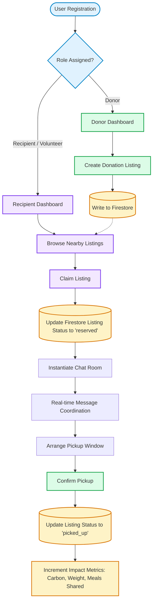

# 🥬 Food Waste Reduction Platform (FWRP)

[](https://nextjs.org)
[](https://typescriptlang.org)
[](https://firebase.google.com/)
[](LICENSE)

FWRP is a modern, community-powered web application dedicated to reducing ecological waste by connecting food donors (bakeries, restaurants, supermarkets) directly with local recipients (charities, food banks, shelters) and volunteers.

---

## 🗺️ Project Flow

This diagram illustrates the core lifecycle, status transitions, and data flows within the platform:



---

## 📂 Project Structure

Below is the directory structure highlighting key folders and files:

```text
FWRP/
├── firestore.rules          # Hardened Firestore document security rules
├── storage.rules            # Firebase Storage image size and mime-type rules
├── firebase.json            # Firebase configuration
├── package.json             # App scripts and core dependencies
├── tailwind.config.ts       # Tailwind CSS design configurations
└── src/
    ├── app/                 # Next.js App Router (force-dynamic routes)
    │   ├── admin/           # Admin Analytics and User moderation pages
    │   ├── api/             # Backend serverless API routes
    │   ├── chat/            # Live chat messaging rooms
    │   ├── complete-profile/# Profile builder onboarding flow
    │   ├── dashboard/       # Core listings lookup, maps, and stats view
    │   ├── donate-food/     # Multi-image food donor creation forms
    │   ├── edit-profile/    # Profile configurations and security tab
    │   ├── globals.css      # Custom animations, fonts, and base layouts
    │   └── layout.tsx       # Root layout, theme config, and hot-toasts
    │
    ├── components/          # Reusable UI component modules
    │   ├── auth/            # Protected route guards
    │   ├── ui/              # Avatar, Button, Card inputs
    │   ├── Sidebar.tsx      # Unified side-nav context navigator
    │   └── Loading.tsx      # Glassmorphic loading screen tips loader
    │
    ├── contexts/            # Global React contexts
    │   └── AuthContext.tsx  # Central state manager for Firebase session syncing
    │
    ├── hooks/               # Custom React hooks
    │   └── useAuth.ts       # Query profile data hooks
    │
    ├── services/            # Firebase SDK service abstraction layer
    │   ├── listingsService.ts # Fetching, pagination, claims, and status mutations
    │   ├── chatsService.ts  # Real-time room listeners and message dispatches
    │   ├── usersService.ts  # Read/write user profile queries
    │   └── storageService.ts# Client-side image compression and storage uploads
    │
    ├── styles/              # Design Tokens
    │   └── tokens.css       # Visual tokens (Emerald color scale, gaps)
    │
    └── utils/               # Form utilities and sanitizers
        ├── sanitize.ts      # Client/server DOMPurify text sanitizer
        └── firebaseErrors.ts# Translate Firebase codes to human alerts
```

---

## 🛠️ Built With

- **Framework**: [Next.js 16 (App Router)](https://nextjs.org/)
- **Language**: [TypeScript](https://www.typescriptlang.org/) (Type-safe compilation checks)
- **Database / Backend**: [Firebase v11](https://firebase.google.com/) (Auth, Firestore, Cloud Storage)
- **Styling**: [Tailwind CSS](https://tailwindcss.com/) & [Vanilla CSS variables](src/styles/tokens.css)
- **Typography**: [Space Grotesk](https://fonts.google.com/specimen/Space+Grotesk) & [Geist Sans](https://vercel.com/font)
- **Notifications**: [React Hot Toast](https://react-hot-toast.com/) (replaces native alerts)
- **Sanitizer**: [DOMPurify](https://github.com/cure53/DOMPurify) (guards inputs from XSS)

---

## 📦 Getting Started

### Prerequisites

- Node.js (version 18 or above recommended)
- Firebase Account (and emulator tools if running rules locally)

### Installation Steps

1. **Clone the repository:**
   ```bash
   git clone https://github.com/Medoix6/FWRP.git
   cd FWRP
   ```

2. **Configure environment credentials:**
   Create a `.env.local` file in the root folder with your Firebase web configuration keys:
   ```env
   NEXT_PUBLIC_FIREBASE_API_KEY=your_api_key
   NEXT_PUBLIC_FIREBASE_AUTH_DOMAIN=your_auth_domain
   NEXT_PUBLIC_FIREBASE_PROJECT_ID=your_project_id
   NEXT_PUBLIC_FIREBASE_STORAGE_BUCKET=your_storage_bucket
   NEXT_PUBLIC_FIREBASE_MESSAGING_SENDER_ID=your_sender_id
   NEXT_PUBLIC_FIREBASE_APP_ID=your_app_id
   ```

3. **Install node packages:**
   ```bash
   npm install
   ```

4. **Boot the development server:**
   ```bash
   npm run dev
   ```

5. Open [http://localhost:3000](http://localhost:3000) in your browser to view the application.

---

## 🛡️ Security Configuration

The platform contains hardened Firebase configuration access rules:
- **Firestore (`firestore.rules`)**:
  - Restricts client-side updates from raising profile privileges (`isAdmin: true`).
  - Ensures listing modifications can only be processed by listing owners.
- **Storage (`storage.rules`)**:
  - Restricts user avatar file uploads to mime-type `image/*` and sizes under 2MB.

---

## 🤝 Contributing

Contributions are welcome! If you want to contribute, please follow these steps:

1. Fork the project
2. Create your feature branch (`git checkout -b feature/AmazingFeature`)
3. Commit your changes (`git commit -m 'Add some AmazingFeature'`)
4. Push to the branch (`git push origin feature/AmazingFeature`)
5. Open a Pull Request

---

## 📄 License

This project is licensed under the MIT License - see the [LICENSE](LICENSE) file for details.

---

## 📫 Contact

- **Author**: [@Medo](https://github.com/Medoix6)
- **Repository Link**: [https://github.com/Medoix6/FWRP](https://github.com/Medoix6/FWRP)
